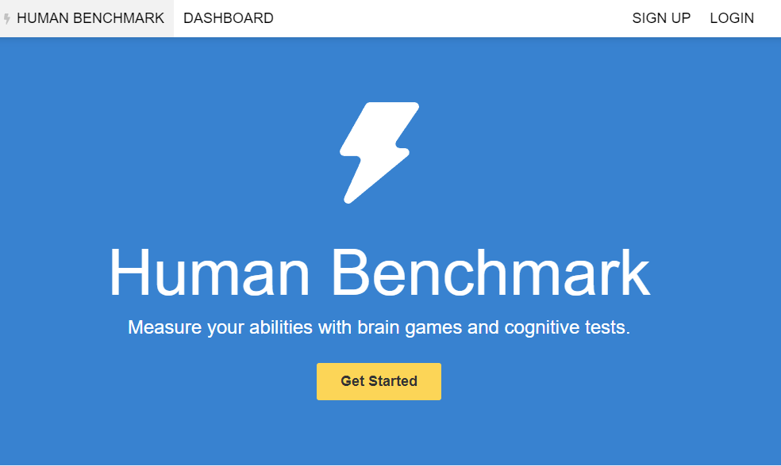

> WebBot made for playing all human benchmark games perfectly, currently its capable of beating most of the games, made with Python and Selenium.

## 💻 Pré-requisitos

Antes de começar, verifique se você atendeu aos seguintes requisitos:

* Você tem uma versão de Python 3+ instalada.
* Você tem uma máquina `<Windows / Linux / Mac>`.

## 🚀 Instalando <benchmark-bot>

Para instalar o <benchmark-bot>, siga estas etapas:

Caso não tenha o Selenium instalado:
```
<pip install -U selenium>
```

Depois basta executar:
```
<python3 main.py>
```

## ☕ Usando <benchmark-bot>

Para usar <benchmark-bot>, bastar seguir as instruções no menu de navegação.
